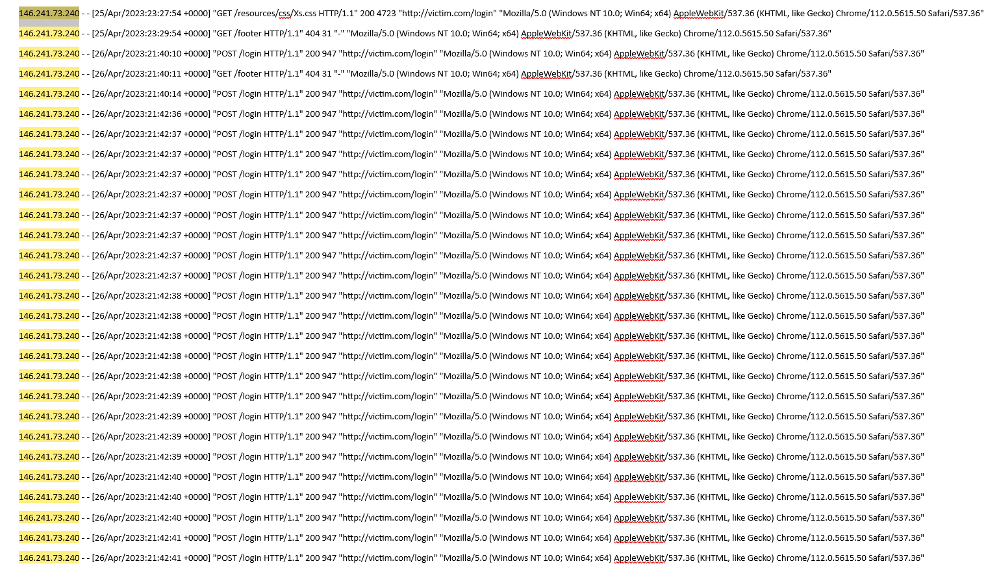

# SOC Investigation: Detecting Brute-Force and Suspicious Login Activity

## Project Overview

In this project, I analyzed web application log activity to identify possible brute-force and suspicious login behavior. The investigation focused on repeated requests involving the login page, credential submission patterns, account creation activity, and repeated requests from the same source IP.

This type of activity is important in security operations because attackers often use repeated login attempts and account abuse techniques to gain unauthorized access or enumerate valid functionality within an application.

---

## Objective

The objective of this investigation was to determine whether the observed web requests represented normal user activity or suspicious authentication-related behavior consistent with brute-force attempts or login abuse.

I reviewed:

- repeated access to the login page
- suspicious credential submission patterns
- account creation flow activity
- repeated requests from the same source IP
- attacker behavior before and after login attempts

---

## Log Source

The investigation was based on web log entries showing repeated activity from source IP **234.161.112.162**.

Examples included:

- access to `/login`
- requests containing credentials in URL parameters such as `uid=test&pw=test`
- account creation requests such as `/newaccount.gtl`
- profile creation activity using `saveprofile?action=new&uid=test&pw=test&is_author=True`
- repeated follow-up requests after login attempts and account actions

These patterns suggested that the source was testing authentication and account-related functionality rather than behaving like a normal user. 

---

## Key Indicators Observed

The following indicators supported a suspicious-login or brute-force assessment:

- repeated requests from source IP **234.161.112.162**
- direct access to the login page multiple times
- credentials passed in URL parameters such as `uid=test&pw=test`
- account creation and profile save activity linked to the same source
- repeated navigation through authentication and user-related functions
- abnormal sequence of requests not typical of ordinary user behavior

These indicators suggested probing, misuse of login functionality, or brute-force-style behavior against the application.

---

## Investigation Process

### 1. Reviewed the source activity

I began by identifying repeated requests from the same source IP and noting the sequence of web requests involving login and account-related functionality.

### 2. Examined login behavior

The logs showed repeated access to `/login` as well as requests containing credential parameters such as `uid=test&pw=test`. This is suspicious because credentials appearing directly in URL parameters often indicate insecure handling or attacker-driven testing behavior.

### 3. Reviewed account creation flow

The same source also accessed `/newaccount.gtl` and then used a profile creation request containing parameters such as `action=new`, `uid=test`, `pw=test`, and `is_author=True`. This suggested the actor was not only testing login access, but also account creation or privilege-related behavior.

### 4. Assessed the sequence of requests

The source moved through login, account creation, snippet access, upload attempts, and user-specific pages in a way that looked more like manual testing or attack exploration than standard user activity.

### 5. Reached a conclusion

Based on the repeated login-related requests, credential patterns, and suspicious account creation flow, I concluded that the activity was consistent with **suspicious authentication behavior and brute-force-style testing**.

---

## Verdict

**Suspicious Activity – Brute-Force / Login Abuse Detected**

This activity was assessed as suspicious because it involved repeated authentication-related requests, credential submission attempts, and abnormal account-related behavior from the same source IP.

Even if the activity did not result in confirmed account compromise, it still represented attacker probing or misuse of authentication functionality.

---

## Attacker Perspective

From the attacker’s perspective, the goal may have been to:

- test login functionality
- guess or reuse credentials
- create a new account
- explore whether elevated permissions could be assigned during account creation
- abuse weak authentication or account validation controls

Attackers often probe login workflows this way before attempting privilege escalation or further exploitation.

---

## Defender Perspective

From a defender’s point of view, this activity should be investigated because:

- repeated login attempts may indicate brute-force behavior
- credentials in URL parameters are a security concern
- suspicious account creation requests may indicate abuse of user management functions
- repeated requests from one source can reveal attacker testing or unauthorized automation

Defenders should review authentication controls, user creation logic, rate limiting, and log patterns for signs of repeated abuse.

---

## SOC Relevance

This project reflects a realistic SOC workflow:

- review authentication-related log activity
- identify suspicious login behavior
- correlate repeated requests from the same source
- determine whether behavior is normal or malicious
- recommend hardening or monitoring improvements

This is directly relevant to junior SOC roles because suspicious authentication activity is one of the most common investigation types handled by analysts.

---

## MITRE ATT&CK Connection

This activity aligns with:

- **Brute Force** for credential access
- **Valid Accounts** if the attacker is attempting to gain access through authentication abuse
- possible **Account Manipulation** if user creation or privilege-related parameters are being abused

---

## Recommended Remediation Actions

The following actions would be appropriate:

- enforce account lockout or rate-limiting controls
- prevent credentials from being transmitted in URL parameters
- review account creation and privilege assignment logic
- monitor for repeated login failures or repeated requests from a single IP
- block or challenge suspicious IPs if behavior continues
- review logs for any successful account creation or unauthorized access

---

## Lessons Learned

This investigation reinforced several important lessons:

- repeated login activity from a single source can indicate brute-force or testing behavior
- credentials in URLs are a security weakness and a strong investigation clue
- account creation flows should be monitored for abuse
- authentication logs are critical for detecting attacker behavior early
- even unsuccessful login abuse attempts should be documented and reviewed

---

## Skills Demonstrated

- log analysis
- authentication monitoring
- brute-force detection
- suspicious activity investigation
- attack pattern recognition
- SOC workflow
- defender mindset

---

## Summary

In this investigation, I analyzed suspicious web log activity involving repeated login attempts, credentials passed in URL parameters, and abnormal account creation behavior from source IP **234.161.112.162**. Based on the request sequence and authentication-focused activity, I assessed the behavior as **suspicious brute-force or login abuse activity**.

This project demonstrates my ability to analyze authentication-related logs, identify suspicious user-access patterns, and apply a structured SOC investigation process.

## Evidence

### Suspicious Brute-Force Login Attempts

