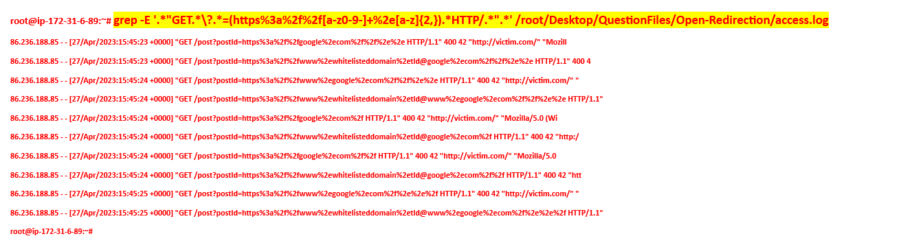
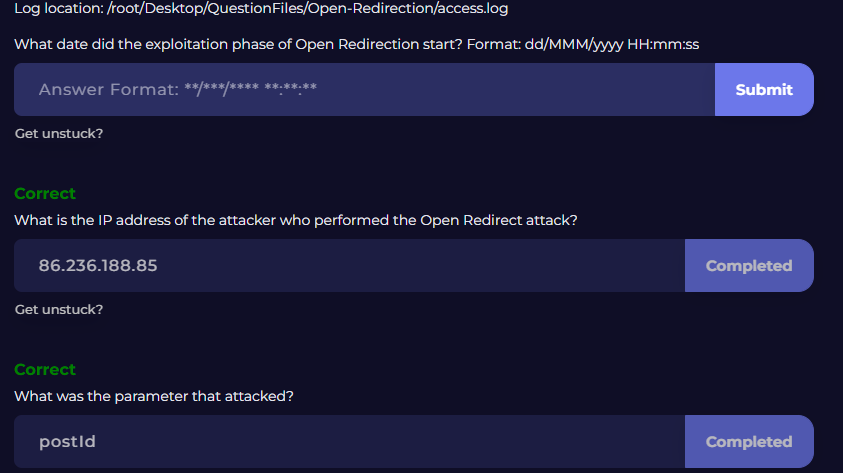

# Web Log Analysis: Detecting Open Redirection Attempts

## Project Overview

In this project, I analyzed web server log activity to identify possible **open redirection attack attempts** against a web application. The investigation focused on suspicious requests that passed external URLs into a query parameter, indicating that an attacker was testing whether the application could be abused to redirect users to malicious destinations.

This type of activity is important in security operations because open redirection vulnerabilities are often used in phishing campaigns, malicious link delivery, and user deception.

---

## Objective

The objective of this investigation was to determine whether the observed HTTP requests indicated normal user activity or malicious probing for an open redirection vulnerability.

I reviewed:

- suspicious query string patterns
- encoded external URLs
- repeated attacker requests
- response behavior from the server
- likely attacker intent

---

## Log Source

The investigation was based on web log entries showing repeated **GET** requests that attempted to pass encoded external URLs through the `postId` parameter.

Examples included requests targeting external destinations such as:

- `https://google.com`
- `https://www.google.com`
- obfuscated variants such as `whitelisteddomain.tld@google.com`

The requests were associated with source IP **86.236.188.85** and returned **HTTP 400** responses. This suggested that the attacker was testing multiple payload formats to see whether the application would accept and process them.

---

## Key Indicators Observed

The following indicators supported the assessment of suspicious open-redirection probing:

- repeated requests from the same source IP: **86.236.188.85**
- multiple encoded external URLs passed into the `postId` parameter
- use of obfuscated redirection formats such as `whitelisteddomain.tld@google.com`
- rapid variation of payload structure
- repeated **HTTP 400** responses indicating the server rejected the malformed or suspicious input

These patterns are not consistent with normal browsing behavior and strongly suggest vulnerability testing or attack reconnaissance.

---

## Investigation Process

### 1. Reviewed suspicious requests

I began by examining the HTTP GET requests in the logs and noticed that the `postId` parameter was being supplied with full encoded external URLs instead of expected internal values.

### 2. Identified redirection-style payloads

The requests included payloads such as encoded references to `google.com` and `www.google.com`, which are commonly used when testing whether an application will redirect a user to an external site.

### 3. Noted obfuscation attempts

Some payloads used values like `whitelisteddomain.tld@google.com`, which is a common attacker trick to disguise the real destination and bypass weak validation.

### 4. Assessed server response behavior

The repeated **HTTP 400** responses suggested that the server was rejecting the requests, which likely prevented successful exploitation in this case.

### 5. Reached a conclusion

Based on the repeated payload testing, encoded external destinations, obfuscation patterns, and response behavior, I concluded that this activity was consistent with **open redirection attack attempts or vulnerability probing**.

---

## Verdict

**Suspicious Activity – Open Redirection Probing Detected**

This activity was assessed as malicious or highly suspicious because it involved repeated attempts to inject external URLs into a web application parameter in order to test redirect behavior.

Although the server returned **HTTP 400** responses, the activity still represented attacker reconnaissance and attempted exploitation.

---

## Attacker Perspective

An attacker testing for open redirection is often trying to find a way to make a legitimate website redirect users to a malicious one.

This can be useful for:

- phishing campaigns
- malicious link delivery
- bypassing user trust
- hiding the final destination behind a trusted domain

If successful, the attacker can abuse the trusted site to make harmful links appear more legitimate.

---

## Defender Perspective

From a defender’s perspective, this activity should be investigated because:

- it may indicate vulnerability scanning or attack reconnaissance
- open redirection can support phishing and social engineering attacks
- repeated malformed requests may reveal weak input validation
- even failed exploitation attempts can signal attacker interest in the application

Defenders should review application validation logic, monitor for repeated abuse patterns, and consider blocking or rate-limiting suspicious sources.

---

## SOC Relevance

This project reflects a realistic SOC task:

- monitor web logs
- identify suspicious request patterns
- determine whether activity is normal or malicious
- assess whether exploitation succeeded
- recommend follow-up actions

This kind of investigation is valuable for junior SOC and cybersecurity analyst roles because it demonstrates log analysis, attack recognition, and defensive reasoning.

---

## MITRE ATT&CK Connection

This activity aligns with:

- **Reconnaissance / vulnerability probing**
- **phishing support through trusted-domain abuse**
- **application attack techniques involving input manipulation**

---

## Recommended Remediation Actions

The following actions would be appropriate:

- validate and sanitize redirect-related parameters
- restrict redirects to approved internal destinations
- log and alert on repeated external URL injection attempts
- block or rate-limit suspicious IPs if activity persists
- review web application behavior for unsafe redirect logic
- monitor for related phishing or abuse attempts

---

## Lessons Learned

This investigation reinforced several key lessons:

- suspicious query parameters can reveal attack attempts even when exploitation fails
- repeated malformed requests often indicate testing behavior
- open redirection may appear simple, but it can support phishing and user deception
- web log analysis is an important part of defensive monitoring
- response codes such as **400** can help determine whether attacks succeeded or failed

---

## Skills Demonstrated

- web log analysis
- threat detection
- attack pattern recognition
- input validation awareness
- security monitoring
- SOC investigation workflow
- defender mindset

---

## Summary

In this investigation, I analyzed suspicious web log activity and identified repeated attempts to inject encoded external URLs into a query parameter. The payload structure, obfuscation techniques, and repeated requests from the same source indicated **open redirection probing**. Although the server responded with **HTTP 400** errors, the activity was still useful from a SOC perspective because it revealed attacker behavior and highlighted the importance of secure input validation.

## Evidence

### Suspicious Open Redirection Requests

### Identified Attacker IP and Targeted Parameter

